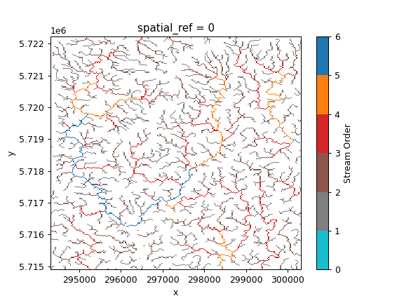

# Examples

Although, PyWBT doesn't have any dependencies, the example notebooks have several
dependencies. You can install all the dependencies using `micromamba`
(or `conda` or `mamba`):

```bash
micormamba create -n wbt pywbt folium geopandas-base>=1 ipykernel ipywidgets mapclassify matplotlib-base planetary-computer pyogrio pystac-client rasterio rioxarray shapely>=2
```

This will create a new environment called `wbt` with all the required packages.
You can also download [this](https://raw.githubusercontent.com/cheginit/pywbt/main/environment.yml) `environment.yml` and create the environment using:

```bash
micromamba env create -f environment.yml
```

Alternatively, though not recommended, you can install the dependencies using `pip`:

```bash
python -m venv ./venv
source ./venv/bin/activate
pip install pywbt folium geopandas ipykernel ipywidgets mapclassify matplotlib planetary-computer pyogrio pystac rasterio rioxarray shapely
```

If you use the `pip` method, you need to install `gdal` for your operating system,
following the instructions in the
[GDAL documentation](https://gdal.org/en/latest/download.html). It's recommended to
avoid using `pip` since it can be difficult to install `gdal` properly.

<div class="grid cards" markdown>

- [{ loading=lazy }](basin.ipynb "Basin Delineation")
    **Basin Delineation**

- [{ loading=lazy }](twi.ipynb "Topographic Wetness Index")
    **Topographic Wetness Index**

</div>
